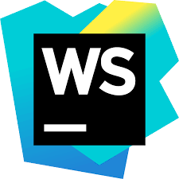
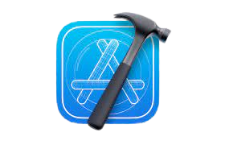

### Hi there 👋

#### I am Sangay Thinley, Developer from kingdom of Bhutan.

Currently working in <b>SELISE Bhutan </b> as web and mobile developer.

## Profile View:

## Experiences:

### List of Languages, frameworks and skills:

### List of Platform and IDE used:

### Get in touch with me:

### GitHub Status:

#### Most language used:

#### Stats:

#### Streak:

### Buy me Coffee

