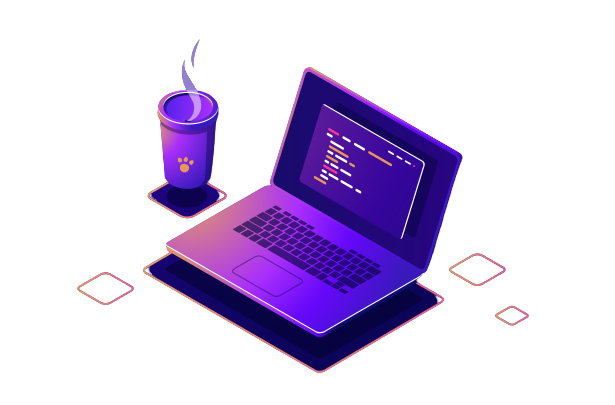

---

## 👋 Hi, I’m Sangay Thinley

I’m a **Senior Software Engineer (Frontend)** from Bhutan 🇧🇹 with strong experience building **modern, scalable web and mobile applications**. I specialize in crafting clean, intuitive user interfaces and robust frontend architectures using **React, React Native, and Next.js**.

I currently work at **SELISE Digital Platforms**, contributing to **SaaS products**, **cross-platform applications**, and **reusable UI systems**. I enjoy solving real-world problems through thoughtful UI/UX design, clean code, and continuous learning.

On GitHub, you’ll find **production-ready projects**, **personal experiments**, and **practice applications** that showcase modern frontend development patterns.

**Tech Focus:** JavaScript, TypeScript, React, Angular, Next.js, React Native, Flutter, Tailwind CSS  
**Interests:** UI/UX engineering, performance optimization, scalable frontend systems  
**Open to:** Collaboration, open-source contributions, and interesting frontend challenges  

---

## 💼 Work Experience

### **Senior Software Engineer (Frontend)**  
**SELISE Group – Blocks Unit** | *Jan 2023 – Present*  
- Building Platform-as-a-Service (PaaS) products across teams in Bhutan and Bangladesh  
- Contributing to frontend architecture, scalable UI systems, and developer experience  
- Working on products such as SELISE Cloud, Construct, UILM browser extension, and npm packages  

**Tech:** React, TypeScript, Next.js (App Router), Tailwind CSS, Radix UI, Node.js and Browser Extensions

---

### **Software Engineer (Frontend)**  
**SELISE Group – AppLab & Blocks Units** | *Jan 2022 – Dec 2023*  
- Led frontend development for multiple client and internal projects  
- Frontend lead for *MoveIt* logistics solution (3 React Native apps + web platform for Switzerland)  
- Contributed to SaaS platforms and high-performance client applications  

**Tech:** React, React Native, Angular, Svelte, Flutter, Next.js, Webpack and Tailwind CSS

---

### **Associate Software Engineer (Frontend)**  
**SELISE Group – AppLab Unit Bhutan** | *May 2020 – Jan 2022*  
- Worked on internal R&D initiatives and in-house UI libraries (Safire)  
- Contributed to reusable UI frameworks and low-code tools  
- Researched and adopted modern frontend technologies  

**Tech:** Angular, React, TypeScript, Svelte, Flutter, Tailwind CSS and Next.js

---

### **Freelance Frontend Engineer**  
*Sep 2021 – Jan 2026*  
- Delivered web and mobile applications for local clients and startups  
- Collaborated on UI/UX design, frontend architecture, and scalable solutions  
- Worked across multiple domains with a strong user-focused approach  

**Tech:** React, React Native, Next.js, Firebase, Material UI, SCSS and Figma

---

### **Intern Developer**  
**Dragon Coder Private Limited** | *Jan 2020 – Feb 2020*  
- Built foundational frontend skills during internship  
- Developed company website using WordPress  

**Tech:** AngularJS, JavaScript, TypeScript, Bootstrap and WordPress

---

## 🧠 Skills & Technologies

### Languages & Frameworks
HTML, CSS, SCSS, JavaScript, TypeScript, Angular, React, React Native, Flutter, Svelte, Next.js, Firebase, Tailwind CSS, Material UI, Styled Components, MySQL, Java, C, C++ and Python

### Tools & Platforms
VS Code, WebStorm, Android Studio, Xcode, GitHub, Vercel, Figma, Trello, Slack, ClickUp, Windsurf, Mongodb, postman and etc

---

## 🌐 Get in Touch

- GitHub: [sangayt1997](https://github.com/sangayt1997)  
- LinkedIn: [Sangay Thinley](https://www.linkedin.com/in/sangay-thinley-47a92b23b)  
- Stack Overflow: [Sangay Thinley](https://stackoverflow.com/users/18950809)  
- Twitter/X: [@SangayT97](https://twitter.com/SangayT97)  
- Upwork: [Profile](https://www.upwork.com/freelancers/~01e9f87220fbc89318)  
- Email: [sangaythinley1694@gmail.com](mailto:sangaythinley1694@gmail.com)  

---

## 📊 GitHub Activity

  
  
  

---

## ☕ Support

---

## 🚀 Featured Projects

### **Spotify Clone**
- Music streaming UI built with React  
- **Demo:** [Live Demo](https://spotify-music-clone-ten.vercel.app/)

### **ePortfolio**
- Personal portfolio website  
- **Demo:** [Live Demo](https://sample-eportfolio.vercel.app/)

### **Nyo Tshong (Shopping App)**
- Practice project using open-source APIs with Next.js (App Router)  
- **Demo:** [Live Demo](https://nyo-tshong-fe.vercel.app/)
