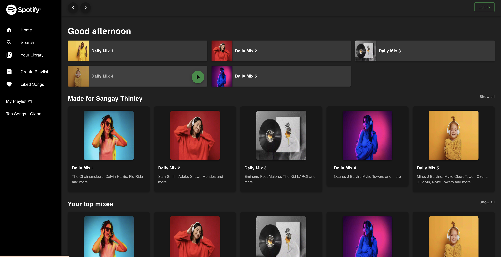
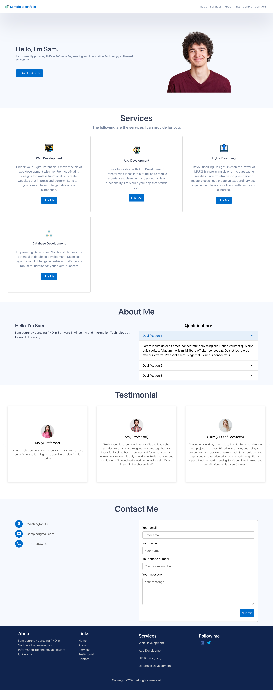

### Hi there 👋

#### I am Sangay Thinley, Developer from kingdom of Bhutan ❤️.

Currently working in <b>SELISE Bhutan </b> as web and mobile developer.

## Profile View:

## Experiences and Skills:

### List of Programming Languages and frameworks used:

### List of Platform and IDE used:

### Get in touch with me:

### GitHub Status:

#### Most language used:

#### Stats:

#### Activity Graph

#### Streak:

### Buy me Coffee

### Projects:
##### 1. Stellar Minds
- Stellar Mind makes Journaling fun and addicting. Write Journal everyday and earn Nourish Point.

##### 2. Spotify Clone
- Creating spotify music platform with react.

##### 3. ePortfolio
- Simple personal ePortfolio.

